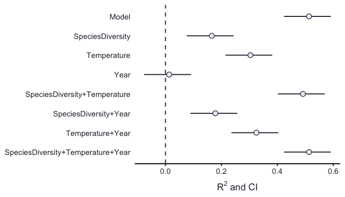

<!-- README.md is generated from README.Rmd. Please edit that file -->

# partR2

The goal of partR2 is to implement methods for LMMs and GLMMs to
estimate the R2 along with it’s confidence intervals as well as
partition the variation explained unique to and common among certain
predictors, which is useful in general but particularly in the case of
multicollinearity. All confidence intervals are estimated using
parametric bootstrapping.

partR2 is in an early phase of development and only works with lme4
models for now.

## Installation

You can install partR2 from github with:

``` r
# install.packages("devtools")
devtools::install_github("mastoffel/partR2")
```

## Example

``` r
library(partR2)
library(lme4)
#> Loading required package: Matrix

?partR2

# load data
data(BeetlesBody)
# fit lme4 model
mod <- lmer(BodyL ~ Sex + Treatment + Habitat + (1|Container) + (1|Population),
            data = BeetlesBody)

# partition R2
R2 <- partR2(mod, partvars = c("Sex", "Treatment", "Habitat"), 
                   R2_type = "marginal", nboot = 50, CI = 0.95)
R2
#> 
#> 
#> R2 (marginal) and CI (95%) for the full model: 
#>  R2    CI_lower CI_upper
#>  0.392 0.304    0.477   
#> 
#> ----------
#> 
#> Partitioned R2s:
#>  Predictor(s)          R2      CI_lower CI_upper
#>  Sex                   0.38584  0.298   0.471   
#>  Treatment             0.00520 -0.083   0.090   
#>  Habitat               0.00031 -0.087   0.086   
#>  Sex+Treatment         0.39119  0.303   0.476   
#>  Sex+Habitat           0.38626  0.299   0.472   
#>  Treatment+Habitat     0.00573 -0.082   0.091   
#>  Sex+Treatment+Habitat 0.39161  0.304   0.477   
#> 
#> ----------
#> 
#> Structure coefficients:
#>  Predictor    r(Yhat,x) CI_lower  CI_upper
#>  SexMale      -0.7452   -8.64e-01 -0.630  
#>  TreatmentExp  0.0877    5.18e-02  0.146  
#>  HabitatB      0.0246    3.08e-05  0.067
```

And to plot the results:

``` r
forestplot(R2, type = "R2")
```

<!-- -->
